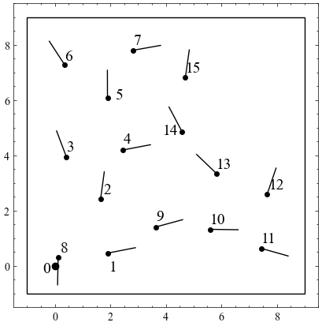

# Simulator_MScThesis

<!-- PROJECT SHIELDS -->
<!--
*** I'm using markdown "reference style" links for readability.
*** Reference links are enclosed in brackets [ ] instead of parentheses ( ).
*** See the bottom of this document for the declaration of the reference variables
*** for contributors-url, forks-url, etc. This is an optional, concise syntax you may use.
*** https://www.markdownguide.org/basic-syntax/#referenc
e-style-links
-->

<!-- ABOUT THE PROJECT -->
## About The Project
This simulator was developed as part of my master thesis within Cybernetics and Robotics at Norwegian University of Sceince and Technology (NTNU). The goal of the thesis was to investigate how micro indoor drones could be deployed incrementally into a GNSS denied disaster area to aid the localization of first responders.

<!-- GETTING STARTED -->
## Getting Started

### Prerequisites (with download links)
* [python](https://www.python.org/downloads/)
* [numpy](https://pypi.org/project/numpy/)
* [matplotlib](https://pypi.org/project/matplotlib/)
* [SciencePlots](https://pypi.org/project/SciencePlots/)

### Installation

1. Clone the repo
   ```sh
   git clone https://github.com/erllon/Simulator_MScThesis.git
   ```
2. Install required packages (see above)

<!-- USAGE EXAMPLES -->
## Usage
<figure><figcaption>image caption</figcaption></figure>

